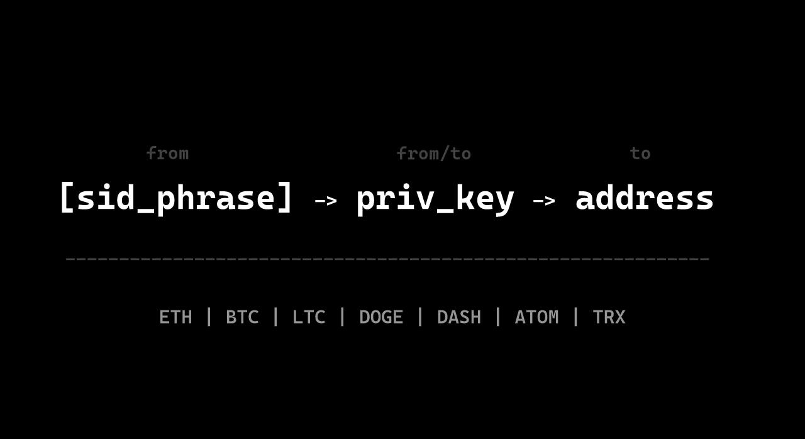

# 🔋 ГЕНЕРАТОР SID-KEY-ADDRESS [ALL-CHAINS]

Скрипт преобразует [сид-фразу в] -> приватный ключ -> адрес для различных криптовалютных сетей. Он поддерживает такие сети, как Ethereum, Bitcoin, Litecoin, Dogecoin, Dash, Atom и Tron. 

### ⚙️ Функционал

1. Генерация приватного ключа и адреса из сид-фразы (с настройкой глубины адреса).
2. Генерация адреса из приватного ключа.

Результаты сохраняются в файл в формате: mnemonic, private_key, address.

## 🔧 Конфигурация

- **Тип данных кошельков:** `mnemonic` или `private_key`
- **Путь к файлу с данными:** укажите путь к файлу с сид-фразами или приватными ключами.
- **Количество адресов для генерации:** укажите глубину адреса, только для сид-фраз.
- **Поддерживаемые сети:** можете раскомментировать необходимые сети в конфигурации.

### ⚡ Дополнительные настройки

- **Папка для результатов:** укажите название папки для сохранения результатов.
- **Количество процессов:** настройте количество процессов для параллельной работы.

## 🌍 in English

SID-KEY-ADDRESS GENERATOR

This script converts [seed phrase] -> private key -> address for various cryptocurrency networks. It supports networks such as Ethereum, Bitcoin, Litecoin, Dogecoin, Dash, Atom, and Tron.

### Features

1. Generate a private key and address from a mnemonic seed phrase (with address depth configuration).
2. Generate an address from a private key.

Results are saved in a file formatted as: mnemonic, private_key, address.

## Configuration

- **Wallet data type:** `mnemonic` or `private_key`
- **Path to wallet data file:** specify the path to the file with seed phrases or private keys.
- **Number of addresses to generate:** specify the address depth, applicable only for seed phrases.
- **Supported networks:** uncomment the necessary networks in the configuration.

### Additional Settings

- **Result folder name:** specify the folder name for saving results.
- **Number of processes:** configure the number of processes for parallel execution.
